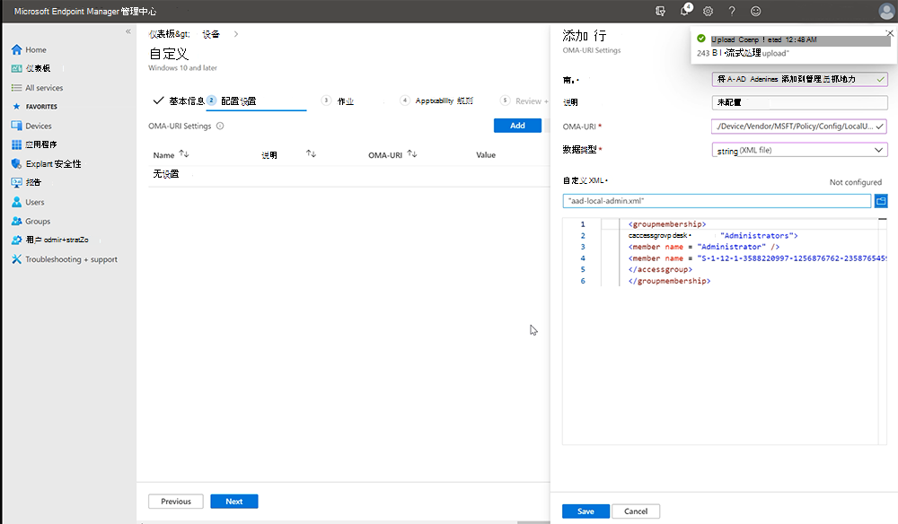

# <a name="configure-non-global-admin-accounts-on-surface-hub"></a><span data-ttu-id="7b9aa-104">配置 Surface Hub 上的非全局管理员帐户</span><span class="sxs-lookup"><span data-stu-id="7b9aa-104">Configure non Global admin accounts on Surface Hub</span></span>

<span data-ttu-id="7b9aa-105">Windows 10 协同版 2020 更新增加了对配置非全局管理员帐户的支持，这些帐户限制加入 Azure AD 域的 Surface Hub 设备上管理 设置 应用的权限。</span><span class="sxs-lookup"><span data-stu-id="7b9aa-105">The Windows 10 Team 2020 Update adds support for configuring non Global admin accounts that limit permissions to management of the Settings app on Surface Hub devices joined to an Azure AD domain.</span></span> <span data-ttu-id="7b9aa-106">这使你能够仅作用域管理员权限Surface Hub并在整个 Azure AD 域中阻止可能不需要的管理员访问权限。</span><span class="sxs-lookup"><span data-stu-id="7b9aa-106">This enables you to scope admin permissions for Surface Hub only and prevent potentially unwanted admin access across an entire Azure AD domain.</span></span> <span data-ttu-id="7b9aa-107">开始之前，请确保你的Surface Hub已加入 Azure AD 和 Intune 自动注册。</span><span class="sxs-lookup"><span data-stu-id="7b9aa-107">Before you begin, make sure your Surface Hub is joined to Azure AD and Intune auto-enrolled.</span></span> <span data-ttu-id="7b9aa-108">如果没有，则需要重置 Surface Hub并完成首次、开箱即用 (OOBE) 安装程序，选择加入 Azure AD 的选项。</span><span class="sxs-lookup"><span data-stu-id="7b9aa-108">If not, you will need to reset Surface Hub and complete the first-time, out-of-the-box (OOBE) setup program, choosing the option to join Azure AD.</span></span>

## <a name="summary"></a><span data-ttu-id="7b9aa-109">摘要</span><span class="sxs-lookup"><span data-stu-id="7b9aa-109">Summary</span></span> 

<span data-ttu-id="7b9aa-110">创建非全局管理员帐户的过程包括以下步骤：</span><span class="sxs-lookup"><span data-stu-id="7b9aa-110">The process of creating non Global admin accounts involves the following steps:</span></span> 

1. <span data-ttu-id="7b9aa-111">在Microsoft Intune中，创建一个安全组，其中包含指定用于管理Surface Hub。</span><span class="sxs-lookup"><span data-stu-id="7b9aa-111">In Microsoft Intune, create a Security group containing the admins designated to manage Surface Hub.</span></span>
2. <span data-ttu-id="7b9aa-112">使用 PowerShell 获取 Azure AD 组 SID。</span><span class="sxs-lookup"><span data-stu-id="7b9aa-112">Obtain Azure AD Group SID using PowerShell.</span></span>
3. <span data-ttu-id="7b9aa-113">创建包含 Azure AD 组 SID 的 XML 文件。</span><span class="sxs-lookup"><span data-stu-id="7b9aa-113">Create XML file containing Azure AD Group SID.</span></span>
4. <span data-ttu-id="7b9aa-114">创建一个安全组Surface Hub由非全局管理员安全组管理的设备。</span><span class="sxs-lookup"><span data-stu-id="7b9aa-114">Create a Security Group containing the Surface Hub devices that will be managed by the non-Global admins Security group.</span></span>
5. <span data-ttu-id="7b9aa-115">创建一个面向包含你的设备的安全组的Surface Hub配置文件。</span><span class="sxs-lookup"><span data-stu-id="7b9aa-115">Create a custom Configuration profile targeting the security group that contains your Surface Hub devices.</span></span> 


## <a name="create-azure-ad-security-groups"></a><span data-ttu-id="7b9aa-116">创建 Azure AD 安全组</span><span class="sxs-lookup"><span data-stu-id="7b9aa-116">Create Azure AD security groups</span></span>

<span data-ttu-id="7b9aa-117">首先创建一个包含管理员帐户的安全组。</span><span class="sxs-lookup"><span data-stu-id="7b9aa-117">First create a security group containing the admin accounts.</span></span> <span data-ttu-id="7b9aa-118">然后，为这些设备创建Surface Hub组。</span><span class="sxs-lookup"><span data-stu-id="7b9aa-118">Then create another security group for Surface Hub devices.</span></span>  

### <a name="create-security-group-for-admin-accounts"></a><span data-ttu-id="7b9aa-119">为管理员帐户创建安全组</span><span class="sxs-lookup"><span data-stu-id="7b9aa-119">Create security group for Admin accounts</span></span>

1. <span data-ttu-id="7b9aa-120">通过管理中心登录 Intune，Microsoft Endpoint Manager组""新[](https://go.microsoft.com/fwlink/?linkid=2109431)组\*\*\*\*  >  \*\*\*\*">"组类型"下，选择"安全 **"。**</span><span class="sxs-lookup"><span data-stu-id="7b9aa-120">Sign into Intune via the [Microsoft Endpoint Manager admin center](https://go.microsoft.com/fwlink/?linkid=2109431), select **Groups** > **New Group** > and under Group type, select **Security.**</span></span> 
2. <span data-ttu-id="7b9aa-121">输入组名称（例如 **，Surface Hub管理员**名称）然后选择"创建 **"。**</span><span class="sxs-lookup"><span data-stu-id="7b9aa-121">Enter a Group name -- for example, **Surface Hub Local Admins** -- and then select **Create.**</span></span> 

     

3. <span data-ttu-id="7b9aa-123">打开组，选择 **"成员**"，然后选择"\*\*\*\* 添加成员"以输入你希望指定为非全局管理员的管理员帐户Surface Hub。</span><span class="sxs-lookup"><span data-stu-id="7b9aa-123">Open the group, select **Members**, and then choose **Add members** to enter the Administrator accounts that you wish to designate as non Global admins on Surface Hub.</span></span> <span data-ttu-id="7b9aa-124">若要了解有关在 Intune 中创建组的信息，请参阅添加  [组以组织用户和设备](https://docs.microsoft.com/mem/intune/fundamentals/groups-add)。</span><span class="sxs-lookup"><span data-stu-id="7b9aa-124">To learn more about creating groups in Intune, see  [Add groups to organize users and devices](https://docs.microsoft.com/mem/intune/fundamentals/groups-add).</span></span>

### <a name="create-security-group-for-surface-hub-devices"></a><span data-ttu-id="7b9aa-125">为设备创建Surface Hub组</span><span class="sxs-lookup"><span data-stu-id="7b9aa-125">Create security group for Surface Hub devices</span></span>

1. <span data-ttu-id="7b9aa-126">重复上述过程，为集线器设备创建单独的安全组;例如 **，Surface Hub设备**。</span><span class="sxs-lookup"><span data-stu-id="7b9aa-126">Repeat the previous procedure to create a separate security group for Hub devices; for example, **Surface Hub devices**.</span></span> 

      

## <a name="obtain-azure-ad-group-sid-using-powershell"></a><span data-ttu-id="7b9aa-128">使用 PowerShell 获取 Azure AD 组 SID</span><span class="sxs-lookup"><span data-stu-id="7b9aa-128">Obtain Azure AD Group SID using PowerShell</span></span>

1. <span data-ttu-id="7b9aa-129">使用提升的帐户权限启动 PowerShell (**以** 管理员) 并确保系统配置为运行 PowerShell 脚本。</span><span class="sxs-lookup"><span data-stu-id="7b9aa-129">Launch PowerShell with elevated account privileges (**Run as Administrator**) and ensure your system is configured to run PowerShell scripts.</span></span> <span data-ttu-id="7b9aa-130">若要了解详情，请参阅关于 [执行策略](https://docs.microsoft.com/powershell/module/microsoft.powershell.core/about/about_execution_policies?)。</span><span class="sxs-lookup"><span data-stu-id="7b9aa-130">To learn more, refer to [About Execution Policies](https://docs.microsoft.com/powershell/module/microsoft.powershell.core/about/about_execution_policies?).</span></span> 
2. <span data-ttu-id="7b9aa-131">[安装Azure PowerShell模块](https://docs.microsoft.com/powershell/azure/install-az-ps)。</span><span class="sxs-lookup"><span data-stu-id="7b9aa-131">[Install Azure PowerShell module](https://docs.microsoft.com/powershell/azure/install-az-ps).</span></span>
3. <span data-ttu-id="7b9aa-132">登录到 Azure AD 租户。</span><span class="sxs-lookup"><span data-stu-id="7b9aa-132">Sign into your Azure AD tenant.</span></span>

    ```powershell
    Connect-AzureAD
    ```

4. <span data-ttu-id="7b9aa-133">登录租户后，运行以下 commandlet。</span><span class="sxs-lookup"><span data-stu-id="7b9aa-133">When you're signed into your tenant, run the following commandlet.</span></span> <span data-ttu-id="7b9aa-134">它将提示你"请键入 Azure AD 组的对象 ID"。</span><span class="sxs-lookup"><span data-stu-id="7b9aa-134">It will prompt you to "Please type the Object ID of your Azure AD Group."</span></span>

    ```powershell
    function Convert-ObjectIdToSid
    {    param([String] $ObjectId)   
         $d=[UInt32[]]::new(4);[Buffer]::BlockCopy([Guid]::Parse($ObjectId).ToByteArray(),0,$d,0,16);"S-1-12-1-$d".Replace(' ','-')
         
    }
    ```

5. <span data-ttu-id="7b9aa-135">在 Intune 中，选择之前创建的组并复制对象 ID，如下图所示。</span><span class="sxs-lookup"><span data-stu-id="7b9aa-135">In Intune, select the group you created earlier and copy the Object id, as shown in the following figure.</span></span> 

     

6. <span data-ttu-id="7b9aa-137">运行以下命令let 获取安全组的 SID：</span><span class="sxs-lookup"><span data-stu-id="7b9aa-137">Run the following commandlet to get the security group's SID:</span></span>

    ```powershell
    $AADGroup = Read-Host "Please type the Object ID of your Azure AD Group"
    $Result = Convert-ObjectIdToSid $AADGroup
    Write-Host "Your Azure Ad Group SID is" -ForegroundColor Yellow $Result
    ```
    
7. <span data-ttu-id="7b9aa-138">将对象 ID 粘贴到 PowerShell 命令let 中，按 **Enter，** 然后将 **Azure AD 组 SID** 复制到文本编辑器中。</span><span class="sxs-lookup"><span data-stu-id="7b9aa-138">Paste the Object id into the PowerShell commandlet, press **Enter**, and then copy the **Azure AD Group SID** into a text editor.</span></span> 

## <a name="create-xml-file-containing-azure-ad-group-sid"></a><span data-ttu-id="7b9aa-139">创建包含 Azure AD 组 SID 的 XML 文件</span><span class="sxs-lookup"><span data-stu-id="7b9aa-139">Create XML file containing Azure AD Group SID</span></span>

1. <span data-ttu-id="7b9aa-140">将以下内容复制到文本编辑器中：</span><span class="sxs-lookup"><span data-stu-id="7b9aa-140">Copy the following into a text editor:</span></span> 

    ```xml
      <groupmembership>   
      <accessgroup desc = "Administrators">        
      <member name = "Administrator" />        
      <member name = "S-1-12-1-XXXXXXXXXX-XXXXXXXXXX-XXXXXXXXXX-XXXXXXXXXX" />  
      </accessgroup>
      </groupmembership>
      ```
      > [!IMPORTANT]
      > <span data-ttu-id="7b9aa-141">请勿从 XML 文件中删除默认的 Administrator 成员。</span><span class="sxs-lookup"><span data-stu-id="7b9aa-141">Do not remove the default Administrator member from the XML file.</span></span>

2. <span data-ttu-id="7b9aa-142">将占位符 SID (S-1-12-1) **Azure AD 组 SID，** 然后将文件另存为 XML;例如 \*\* ，aad-local-admin.xml\*\*。</span><span class="sxs-lookup"><span data-stu-id="7b9aa-142">Replace the placeholder SID (beginning with S-1-12-1) with your **Azure AD Group SID** and then save the file as XML; for example, **aad-local-admin.xml**.</span></span> 

## <a name="create-custom-configuration-profile"></a><span data-ttu-id="7b9aa-143">创建自定义配置文件</span><span class="sxs-lookup"><span data-stu-id="7b9aa-143">Create Custom configuration profile</span></span>

1. <span data-ttu-id="7b9aa-144">In Endpoint Manager， select **Devices**  >  **Configuration profiles**Create  >  **profile**.</span><span class="sxs-lookup"><span data-stu-id="7b9aa-144">In Endpoint Manager, select **Devices** > **Configuration profiles** > **Create profile**.</span></span> 
2. <span data-ttu-id="7b9aa-145">在"平台"**下Windows 10选择"应用和更高版本"。**</span><span class="sxs-lookup"><span data-stu-id="7b9aa-145">Under Platform select **Windows 10 and later.**</span></span> <span data-ttu-id="7b9aa-146">在"配置文件"下 **，选择"自定义**"，然后选择"创建 **"。**</span><span class="sxs-lookup"><span data-stu-id="7b9aa-146">Under Profile, select **Custom**, and then select **Create.**</span></span>
3. <span data-ttu-id="7b9aa-147">添加名称和说明，然后选择"下一 **步"。**</span><span class="sxs-lookup"><span data-stu-id="7b9aa-147">Add a name and description and then select **Next.**</span></span>
4. <span data-ttu-id="7b9aa-148">在**配置设置**  >  **OMA-URI 设置**下，\*\*\*\* 选择添加 。</span><span class="sxs-lookup"><span data-stu-id="7b9aa-148">Under **Configuration settings** > **OMA-URI Settings**, select **Add**.</span></span>
5. <span data-ttu-id="7b9aa-149">在"添加行"窗格中，添加名称，在     **OMA-URI**下添加以下字符串：</span><span class="sxs-lookup"><span data-stu-id="7b9aa-149">In the Add Row pane, add a name and under     **OMA-URI**, add the following  string:</span></span> 

    ```OMA-URI
    ./Device/Vendor/MSFT/Policy/Config/RestrictedGroups/ConfigureGroupMembership
    ```
6. <span data-ttu-id="7b9aa-150">在"数据类型"下，选择 **"字符串 XML"** 并浏览以打开在上一步中创建的 XML 文件。</span><span class="sxs-lookup"><span data-stu-id="7b9aa-150">Under Data type, select **String XML** and browse to open the XML file you created in the previous step.</span></span> 

     

7. <span data-ttu-id="7b9aa-152">单击 **“保存”**。</span><span class="sxs-lookup"><span data-stu-id="7b9aa-152">Click **Save**.</span></span>
8. <span data-ttu-id="7b9aa-153">单击 **"选择要包含的组**"，然后选择之前[在](#create-security-group-for-surface-hub-devices) (Surface Hub**创建的安全**) 。</span><span class="sxs-lookup"><span data-stu-id="7b9aa-153">Click **Select groups to include** and choose the [security group you created earlier](#create-security-group-for-surface-hub-devices) (**Surface Hub devices**).</span></span> <span data-ttu-id="7b9aa-154">单击“下一步”\*\*\*\*。</span><span class="sxs-lookup"><span data-stu-id="7b9aa-154">Click **Next.**</span></span>
9. <span data-ttu-id="7b9aa-155">在"适用性规则"下，根据需要添加"规则"。</span><span class="sxs-lookup"><span data-stu-id="7b9aa-155">Under Applicability rules, add a Rule if desired.</span></span> <span data-ttu-id="7b9aa-156">否则，请选择 **"下一**步"，然后选择"创建 **"。**</span><span class="sxs-lookup"><span data-stu-id="7b9aa-156">Otherwise, select **Next** and then select **Create**.</span></span>

<span data-ttu-id="7b9aa-157">若要了解有关使用 OMA-URI 字符串的自定义配置文件，请参阅在[Intune Windows 10自定义设置](https://docs.microsoft.com/mem/intune/configuration/custom-settings-windows-10)。</span><span class="sxs-lookup"><span data-stu-id="7b9aa-157">To learn more about custom configuration profiles using OMA-URI strings, see [Use custom settings for Windows 10 devices in Intune](https://docs.microsoft.com/mem/intune/configuration/custom-settings-windows-10).</span></span>


## <a name="non-global-admins-managing-surface-hub"></a><span data-ttu-id="7b9aa-158">非全局管理员管理Surface Hub</span><span class="sxs-lookup"><span data-stu-id="7b9aa-158">Non Global admins managing Surface Hub</span></span>

<span data-ttu-id="7b9aa-159">现在 **，Surface Hub本地管理员**安全组的成员可以登录到 设置 应用Surface Hub管理设置。</span><span class="sxs-lookup"><span data-stu-id="7b9aa-159">Members of the **Surface Hub Local Admins** Security group can now sign in to the Settings app on Surface Hub and manage settings.</span></span>

> [!IMPORTANT]
> <span data-ttu-id="7b9aa-160">全局管理员对 设置 应用的默认访问权限 (除非他们也是此新安全组的成员) 。</span><span class="sxs-lookup"><span data-stu-id="7b9aa-160">The default access of global admins to the Settings app is removed (unless they are also members of this new security group).</span></span>
