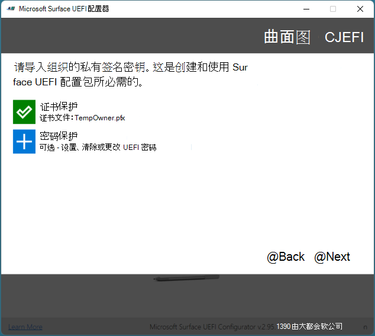

# 使用 SEMM 注册并配置 Surface 设备

使用 Microsoft Surface Enterprise 管理模式（SEMM），你可以安全地在 Surface 设备上配置 Surface UEFI 的设置，并在你的组织中的 Surface 设备上管理这些设置。 当 Surface 设备由 SEMM 管理时，该设备将被视为已*注册*（有时称为已激活）。 本文介绍如何创建一个 Surface UEFI 配置包，该程序包不仅可以控制 Surface UEFI 的设置，还会在 SEMM 中注册 Surface 设备。

有关 SEMM 的更高级别概述，请参阅[Microsoft Surface 企业管理模式](https://technet.microsoft.com/itpro/surface/surface-enterprise-management-mode)。

管理 Surface Pro X 和 Surface 笔记本电脑3上的云中的固件的一种简化方法现在可通过公共预览版获得。 有关详细信息，请参阅[SURFACE UEFI 设置的 Intune 管理](surface-manage-dfci-guide.md)。

> [!NOTE]
> SEMM 仅通过 UEFI 管理器在 Surface Pro X 上受支持。 有关详细信息，请参阅[部署、管理和维护 Surface Pro X](surface-pro-arm-app-management.md)。

#### 下载并安装 Microsoft Surface UEFI 配置器
用于创建 SEMM 程序包的工具是 Microsoft Surface UEFI 配置器。 你可以从 Microsoft 下载中心的[IT "Surface Tools for IT](https://www.microsoft.com/download/details.aspx?id=46703) " 页面下载 MICROSOFT Surface UEFI 配置器。
运行 Microsoft Surface UEFI 配置器 Windows Installer （.msi）文件以启动该工具的安装。 安装程序完成后，在 "开始" 菜单的 "所有应用" 部分中查找 Microsoft Surface UEFI 配置器。

>[!NOTE]
>仅在 Windows 10 上支持 Microsoft Surface UEFI 配置器。

## 创建 Surface UEFI 配置包

Surface UEFI 配置包执行将 Surface UEFI 设置的新配置应用到使用 SEMM 管理的 Surface 设备和 SEMM 中注册 Surface 设备的角色的角色。 创建配置程序包要求你拥有与 SEMM 一起使用的签名证书，以确保每个 Surface 设备上的 UEFI 设置的配置安全。 有关 SEMM 证书的要求的详细信息，请参阅[Microsoft Surface 企业管理模式](https://technet.microsoft.com/itpro/surface/surface-enterprise-management-mode)。

若要创建 Surface UEFI 配置包，请执行以下步骤：

1. 从 "开始" 菜单打开 Microsoft Surface UEFI 配置器。
2. 单击**开始**。
3. 单击 "**配置包**"，如图1所示。

   

   *图 1. 选择 "配置包" 以创建 SEMM 注册和配置的程序包*

4. 单击 "**证书保护**" 以添加导出的带有私钥（.pfx）的证书文件，如图2所示。 通过浏览找到您的证书文件的位置，选择该文件，然后单击 **"确定"**。

   

   *图 2. 将 SEMM 证书和 Surface UEFI 密码添加到 Surface UEFI 配置包*

5. 当系统提示您确认证书密码时，请输入并确认您的证书文件的密码，然后单击 **"确定"**。
6. 单击 "**密码保护**" 以将密码添加到 Surface UEFI。 当您启动到 UEFI 时，将需要此密码。 如果未输入此密码，则仅显示**电脑信息**、 **"****企业管理**" 和 "**退出**页面"。 此步骤可选。
7. 出现提示时，请输入并确认你为 Surface UEFI 选择的密码，然后单击 **"确定"**。 如果要清除现有 Surface UEFI 密码，请将 "密码" 字段保留为空。
8. 如果不希望将 Surface UEFI 包应用于特定设备，请在 "**选择要确定的目标图面类型**" 页面上，单击相应 surface Book 或 Surface Pro 4 图像下方的滑块，使其位于 "**关**" 位置。 （如图3所示。）
   > [!NOTE] 
   > 默认情况下，选择 "无"，则必须选择设备。

   

   *图 3. 选择用于程序包兼容性的设备*

9. 单击“下一步”****。
10. 如果要停用托管 Surface 设备上的组件，请在 "**选择要激活或停用的组件**" 页面上，单击要停用的任何设备或设备组旁边的滑块，以使滑块位于**关闭**位置。 （如图4所示。）每个设备的默认配置均为 **"开**"。 如果要将所有滑块恢复到默认位置，请单击 "**重置**" 按钮。

    

    *图 4. 禁用或启用单个 Surface 组件*

11. 单击“下一步”****。
12. 若要在 Surface UEFI 或 Surface UEFI 页面的显示中启用或禁用高级选项，请在 "**选择设备的高级设置**" 页面上，单击所需设置旁边的滑块以将该选项配置为 **"打开" 或 "** **关闭**" （如图5所示）。 在 " **UEFI 前页**" 部分中，你可以使用 "**安全**"、"**设备**" 和 "**启动**" 滑块来控制启动到 Surface UEFI 的用户可以使用哪些页面。 （有关 Surface UEFI 设置的详细信息，请参阅[管理 SURFACE uefi 设置](https://technet.microsoft.com/itpro/surface/manage-surface-uefi-settings)。）完成选择生成和保存程序包的选项后，单击 "**生成**"。

    

    *图 5. 通过 SEMM 控制高级 Surface UEFI 设置和 Surface UEFI 页面*

13. 在 "**另存为**" 对话框中，指定 Surface UEFI 配置包的名称，浏览到要保存文件的位置，然后单击 "**保存**"。
14. 创建并保存程序包后，将显示**成功**的页面。

>[!NOTE]
>记录此页面上显示的证书指纹字符，如图6所示。 你将需要这些字符来确认在 SEMM 中注册新的 Surface 设备。 单击 "**结束**" 以完成程序包创建并关闭 MICROSOFT Surface UEFI 配置器。

*图 6. 证书指纹的最后两个字符显示在成功的页面上*

现在，你已创建 Surface UEFI 配置包，你可以注册或配置 Surface 设备。

>[!NOTE]
>创建 Surface UEFI 配置包时，将在桌面上创建日志文件，其中包含配置程序包设置和选项的详细信息。

## 在 SEMM 中注册 Surface 设备
当执行 Surface UEFI 配置包时，SEMM 证书和 Surface UEFI 配置文件将暂存在 Surface 设备的固件存储中。 当 Surface 设备重新启动时，Surface UEFI 处理这些文件，并开始在 SEMM 中应用 Surface UEFI 配置或注册 Surface 设备的过程，如图7所示。

*图 7. 用于配置 Surface UEFI 或注册 Surface 设备的 SEMM 过程*

开始在 SEMM 中注册 Surface 设备之前，请确保你有证书指纹的最后两个字符。 你将需要这些字符来确认设备的注册（请参阅图6）。

若要使用 Surface UEFI 配置包在 SEMM 中注册 Surface 设备，请按照以下步骤操作：

1. 在要在 SEMM 中注册的 Surface 设备上运行 Surface UEFI 配置程序包 .msi 文件。 这将在设备固件中设置 Surface UEFI 配置文件。
2. 选中 "**我接受许可协议中的条款**" 复选框以接受最终用户许可协议（EULA），然后单击 "**安装**" 以开始安装过程。
3. 单击 "**完成**" 以完成 surface UEFI 配置程序包安装，并在系统提示时重启 surface 设备。
4. Surface UEFI 将加载配置文件并确定设备上未启用 SEMM。 然后，Surface UEFI 将开始 SEMM 注册过程，如下所示：
   * Surface UEFI 将验证 SEMM 配置文件是否包含 SEMM 证书。
   * Surface UEFI 将提示你输入证书指纹的最后两个字符以确认在 SEMM 中注册 Surface 设备，如图8所示。

      

      *图 8. SEMM 中的注册需要证书指纹的最后两个字符*

   * Surface UEFI 将在固件中存储 SEMM 证书，并应用 Surface UEFI 配置文件中指定的配置设置。
   
5. Surface 设备现在已注册 SEMM 并将启动到 Windows。

通过在 "事件查看器" 的 "**应用程序和服务日志**" 下的 "应用程序和服务日志" 下的 "应用**程序**和服务日志" 下找到的 "Microsoft surface **UEFI** **配置包**" （如图10所示），可以验证是否已在 SEMM 中成功注册了 surface 设备。

*图 9. 验证在 SEMM 中的 "程序和功能" 中注册 Surface 设备*

*图 10. 在事件查看器的 SEMM 中验证是否注册 Surface 设备*

你还可以验证设备是否已在 SEMM 在 Surface UEFI 中注册-当设备已注册时，Surface UEFI 将包含**企业管理**页面（如图11所示）。

*图 11. Surface UEFI 企业版管理页面*

## 通过 SEMM 配置 Surface UEFI 设置

在 SEMM 中注册设备后，你可以运行使用同一 SEMM 证书签名的 Surface UEFI 配置包来应用新的 Surface UEFI 设置。 下次启动设备时将自动应用这些设置，而不与用户进行任何交互。 你可以使用 Microsoft 终结点配置管理器等应用程序部署解决方案将 Surface UEFI 配置包部署到 Surface 设备，以更改或管理 Surface UEFI 中的设置。

有关如何通过配置管理器部署 Windows Installer （.msi）文件的详细信息，请参阅[通过 Microsoft 终结点配置管理器部署和管理应用程序](https://technet.microsoft.com/library/mt627959)。

如果您有安全的 Surface UEFI 和密码，则没有尝试启动到 Surface UEFI 的密码的用户将仅显示**PC 信息** **，包括 "****企业管理**" 和 "**退出**页面"。

如果你没有安全的 Surface UEFI （使用密码或用户输入正确的密码），则使用 SEMM 配置的设置将灰显（不可用），并且您的组织管理某些设置的文本将显示在页面顶部，如图12所示。

*图 12. SEMM 托管的设置将在 Surface UEFI 中禁用*
