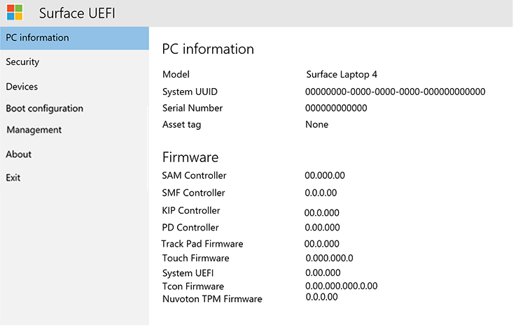
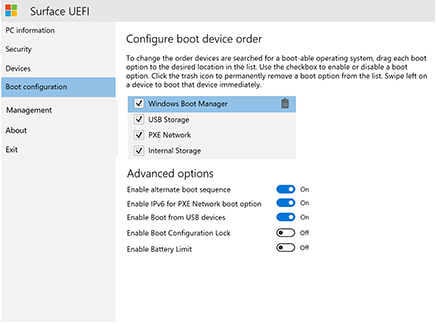

# 管理 Surface UEFI 设置Manage Surface UEFI settings

所有当前和将来的 Surface 设备都使用 Microsoft 专门为这些设备 (UEFI) 唯一的统一可扩展固件接口。All current and future generations of Surface devices use a unique Unified Extensible Firmware Interface (UEFI) engineered by Microsoft specifically for these devices. Surface UEFI 设置提供启用或禁用内置设备和组件、防止更改 UEFI 设置以及调整 Surface 设备启动设置的能力。Surface UEFI settings provide the ability to enable or disable built-in devices and components, protect UEFI settings from being changed, and adjust the Surface device boot settings. 

## 支持的产品Supported products

以下各项支持 UEFI 管理：UEFI management is supported on the following: 

- Surface Pro 4、Surface Pro (第五代) 、Surface Pro 6、Surface Pro 7、Surface Pro 7+、Surface Pro XSurface Pro 4, Surface Pro (5th Gen), Surface Pro 6, Surface Pro 7, Surface Pro 7+, Surface Pro X
- Surface Laptop (第一代) 、Surface Laptop 2、Surface Laptop 3、Surface Laptop GoSurface Laptop (1st Gen), Surface Laptop 2, Surface Laptop 3, Surface Laptop Go
- Surface Studio (1 代) Surface Studio 2Surface Studio (1st Gen), Surface Studio 2
- Surface Book、Surface Book 2、Surface Book 3Surface Book, Surface Book 2, Surface Book 3
- Surface Go、Surface Go 2Surface Go, Surface Go 2

## 支持基于云的管理Support for cloud-based management

借助内置于 Microsoft Intune (中的设备固件配置接口 (DFCI) 配置文件) ，Surface UEFI 管理可将新式管理堆栈向下扩展到 UEFI 硬件级别。With Device Firmware Configuration Interface (DFCI) profiles built into Microsoft Intune (now available in public preview), Surface UEFI management extends the modern management stack down to the UEFI hardware level. DFCI 支持零接触预配、消除 BIOS 密码、控制安全设置（包括启动选项和内置外设）并在将来为高级安全方案打下基础。DFCI supports zero-touch provisioning, eliminates BIOS passwords, provides control of security settings including boot options and built-in peripherals, and lays the groundwork for advanced security scenarios in the future. DFCI 目前可用于 Surface Pro 7+、Surface Laptop Go、Surface Book 3、Surface Laptop 3、Surface Pro 7 和 Surface Pro X。 有关详细信息，请参阅 Surface [UEFI 设置的 Intune 管理](surface-manage-dfci-guide.md)。DFCI is currently available for Surface Pro 7+, Surface Laptop Go, Surface Book 3, Surface Laptop 3, Surface Pro 7, and Surface Pro X.  For more information, refer to [Intune management of Surface UEFI settings](surface-manage-dfci-guide.md).

## 打开 Surface UEFI 菜单Open Surface UEFI menu

在系统启动期间调整 UEFI 设置：To adjust UEFI settings during system startup:

1. 关闭 Surface 并等待大约 10 秒以确保其关闭。Shut down your Surface and wait about 10 seconds to make sure it's off.
2. 长按 **"调高音量** "按钮，同时按下并释放 **电源按钮。**Press and hold the **Volume-up** button  and - at the same time - press and release the **Power button.**
3. 当 Microsoft 或 Surface 徽标显示在屏幕上时，请继续\*\*\*\* 按住"调高"按钮，直到出现 UEFI 屏幕。As the Microsoft or Surface logo appears on your screen, continue to hold the **Volume-up** button until the UEFI screen appears.

## UEFI 电脑信息页UEFI PC information page

电脑信息页包含有关 Surface 设备的详细信息：The PC information page includes detailed information about your Surface device: 

- **型号** – Surface 设备的型号将在此处显示，例如 Surface Book 2 或 Surface Pro 7。**Model** – Your Surface device’s model will be displayed here, such as Surface Book 2 or Surface Pro 7. 不会显示设备的具体配置（例如处理器、磁盘大小或内存大小）。The exact configuration of your device is not shown, (such as processor, disk size, or memory size). 
- **UUID** - 此通用唯一标识号特定于设备，用于在部署或管理期间标识设备。**UUID** – This Universally Unique Identification number is specific to your device and is used to identify the device during deployment or management. 

- **序列号** - 此编号用于标识资源标记和支持场景的特定 Surface 设备。**Serial Number** – This number is used to identify this specific Surface device for asset tagging and support scenarios.
- **资源标记** - 资源标记通过[资源标记工具](https://docs.microsoft.com/surface/assettag)分配到 Surface 设备。**Asset Tag** – The asset tag is assigned to the Surface device with the [Asset Tag Tool](https://docs.microsoft.com/surface/assettag). 

还可以找到关于 Surface 设备固件的详细信息。You will also find detailed information about the firmware of your Surface device. Surface 设备具有多个内部组件，每个组件运行不同版本的固件。Surface devices have several internal components that each run different versions of firmware. 以下所有设备的固件版本显示在**电脑信息**页上（如图 1 所示）：The firmware version of each of the following devices is displayed on the **PC information** page (as shown in Figure 1): 

- 系统 UEFISystem UEFI 

- SAM 控制器SAM Controller 

- Intel 管理引擎Intel Management Engine 

- 系统嵌入式控制器System Embedded Controller 

- 触摸固件Touch Firmware 

*图 1.Figure 1. 系统信息和固件版本信息System information and firmware version information*

在设备的 [Surface 更新历史记录](https://www.microsoft.com/surface/support/install-update-activate/surface-update-history)中可以找到有关 Surface 设备最新固件版本的最新信息。You can find up-to-date information about the latest firmware version for your Surface device in the [Surface Update History](https://www.microsoft.com/surface/support/install-update-activate/surface-update-history) for your device. 

## "UEFI 安全性"页UEFI Security page 

*图 2.Figure 2. 配置 Surface UEFI 安全设置Configure Surface UEFI security settings*

"安全"页允许你设置密码以保护 UEFI 设置。The Security page allows you to set a password to protect UEFI settings. 在将 Surface 设备启动到 UEFI 时，必须输入此密码。This password must be entered when you boot the Surface device to UEFI. 密码可以包含以下字符 (如图) 3 所示：The password can contain the following characters (as shown in Figure 3): 

- 大写字母：A-ZUppercase letters: A-Z 

- 小写字母：a-zLowercase letters: a-z 

- 数字：1-0Numbers: 1-0 

- 特殊字符：！@#$%^&\* () ？<>{} []-_=+|.，;：''"Special characters: !@#$%^&\*()?<>{}[]-_=+|.,;:’\`” 

密码必须最少为 6 个字符，并且区分大小写。The password must be at least 6 characters and is case sensitive. 

*图 3.Figure 3. 添加保护 Surface UEFI 设置的密码Add a password to protect Surface UEFI settings*

在安全页上，还可以更改 Surface 设备的安全启动配置。On the Security page you can also change the configuration of Secure Boot on your Surface device. 安全启动技术可阻止未经授权的启动代码启动 Surface 设备，这可防御 bootkit 和 rootkit 类型的恶意软件感染。Secure Boot technology prevents unauthorized boot code from booting on your Surface device, which protects against bootkit and rootkit-type malware infections. 可以禁用安全启动，从而允许 Surface 设备启动第三方操作系统或可启动媒体。You can disable Secure Boot to allow your Surface device to boot third-party operating systems or bootable media. 还可以配置安全启动以使用第三方证书，如图 4 所示。You can also configure Secure Boot to work with third-party certificates, as shown in Figure 4. 在 TechNet 库中阅读有关[安全启动](https://msdn.microsoft.com/windows/hardware/commercialize/manufacture/desktop/secure-boot-overview)的详细信息。Read more about [Secure Boot](https://msdn.microsoft.com/windows/hardware/commercialize/manufacture/desktop/secure-boot-overview) in the TechNet Library.

*图 4.Figure 4. 配置安全启动Configure Secure Boot*

根据你的设备，你可能还能够查看你的 TPM 是已启用还是已禁用。Depending on your device, you may also be able to see if your TPM is enabled or disabled. 如果看不到"启用 **TPM"**  设置，请在 Windows 中打开 tpm.msc 以检查状态，如图 5 所示。If you do not see the **Enable TPM**  setting, open tpm.msc in Windows to check the status, as shown in Figure 5. TPM 用于与 BitLocker 一起验证设备数据的加密情况。The TPM is used to authenticate encryption for your device’s data with BitLocker. 若要了解更多信息，请参阅 [BitLocker 概述](https://docs.microsoft.com/windows/security/information-protection/bitlocker/bitlocker-overview)。To learn more, see [BitLocker overview](https://docs.microsoft.com/windows/security/information-protection/bitlocker/bitlocker-overview). 

*图 5.Figure 5. TPM 控制台TPM console*

## UEFI 菜单：设备UEFI menu: Devices 

"设备"页允许你启用或禁用特定设备和组件，包括：The Devices page allows you to  enable or disable specific devices and components including:

- 扩展坞和 USB 端口Docking and USB Ports 

- MicroSD 或 SD 卡槽MicroSD or SD Card Slot 

- 后置摄像头Rear Camera 

- 前置摄像头Front Camera 

- 红外 (IR) 相机Infrared (IR) Camera 

- WLAN 和蓝牙Wi-Fi and Bluetooth 

- 板载音频（扬声器和麦克风）Onboard Audio (Speakers and Microphone) 

每个设备都列出一个滑块按钮，你可以将其移动到 (\*\*\*\* 启用 **) 或 (** 禁用) 位置，如图 6 所示。Each device is listed with a slider button that you can move to **On** (enabled) or **Off** (disabled) position, as shown in Figure 6. 

*图 6.Figure 6. 启用和禁用特定设备Enable and disable specific devices*

## UEFI 菜单：启动配置UEFI menu: Boot configuration 

"启动配置"页允许你更改启动设备的顺序，以及启用或禁用以下设备的启动：The Boot Configuration page allows you to change the order of your boot devices as well as enable or disable boot of the following devices: 

- Windows 启动管理器Windows Boot Manager 

- USB 存储USB Storage 

- PXE 网络PXE Network 

- 内部存储Internal Storage 

可以立即启动特定设备，或使用触摸屏在列表中向左滑动该设备项。You can boot from a specific device immediately, or you can swipe left on that device’s entry in the list using the touchscreen. 还可以在关闭 Surface 设备电源时，同时按**调低音量**按钮和**电源**按钮，立即启动到 USB 设备或 USB 以太网适配器。You can also boot immediately to a USB device or USB Ethernet adapter when the Surface device is powered off by pressing the **Volume Down** button and the **Power** button simultaneously. 

若要使指定的启动顺序生效，必须将"启用 **备用** 启动序列"选项设置为 **"打开**"，如图 7 所示。For the specified boot order to take effect, you must set the **Enable Alternate Boot Sequence** option to **On**, as shown in Figure 7. 

*图 7.Figure 7. 配置 Surface 设备的启动顺序Configure the boot order for your Surface device* 

在使用 PXE 服务器仅为 IPv4 配置的 PXE 部署 Windows 时，还可以使用**启用用于 PXE 网络启动的 IPv6** 选项来打开和关闭对 PXE 的 IPv6 支持。You can also turn on and off IPv6 support for PXE with the **Enable IPv6 for PXE Network Boot** option, for example when performing a Windows deployment using PXE where the PXE server is configured for IPv4 only.  

## UEFI 菜单：管理UEFI menu: Management
"管理"页允许你在符合条件的设备（包括 Surface Pro 7、Surface Pro X 和 Surface Laptop 3）上管理零接触 UEFI 管理和其他功能的使用。The Management page allows you to manage use of Zero Touch UEFI Management and other features on eligible devices including Surface Pro 7, Surface Pro X, and Surface Laptop 3.  

 *图 8。管理对零接触 UEFI 管理和其他功能的访问权限*Manage access to Zero Touch UEFI Management and other features](images/manage-surface-uefi-fig7a.png "Manage access to Zero Touch UEFI Management and other features")
*Figure 8. Manage access to Zero Touch UEFI Management and other features* 

零接触 UEFI 管理允许你使用 Intune 中的设备配置文件（称为设备固件配置接口 (DFCI) ） 远程管理 UEFI 设置。Zero Touch UEFI Management lets you remotely manage UEFI settings  by using a device profile within Intune called Device Firmware Configuration Interface (DFCI). 如果未配置此设置，则使用 DFCI 管理符合条件的设备的能力设置为 **"就绪"。**If you do not configure this setting, the ability to manage eligible devices with DFCI is set to **Ready**. 若要阻止 DFCI，请选择 **"选择退出"。**To prevent DFCI, select **Opt-Out**. 

> [!NOTE]
> UEFI 管理设置页和 DFCI 的使用目前适用于 Surface Pro 7+、Surface Laptop Go、Surface Book 3、Surface Laptop 3、Surface Pro 7 和 Surface Pro X。若要了解更多信息，请参阅 [Surface UEFI 设置的 Intune 管理](surface-manage-dfci-guide.md)。The UEFI Management settings page and use of DFCI is currently available for Surface Pro 7+, Surface Laptop Go, Surface Book 3, Surface Laptop 3, Surface Pro 7, and Surface Pro X. To learn more, see [Intune management of Surface UEFI settings](surface-manage-dfci-guide.md).

## UEFI 菜单：退出UEFI menu: Exit 

使用"**退出"** 页上的"\*\*\*\* 立即重启"按钮退出 UEFI 设置，如图 9 所示。Use the **Restart Now** button on the **Exit** page to exit UEFI settings, as shown in Figure 9. 

*图 9.Figure 9. 单击“立即重启”退出 Surface UEFI，并重启设备Click Restart Now to exit Surface UEFI and restart the device*

## Surface UEFI 启动屏幕Surface UEFI boot screens

当你通过 Windows 更新或手动安装更新 Surface 设备固件时，更新不会立即适用于设备，而是在下个重新启动周期应用。When you update Surface device firmware, by using either Windows Update or manual installation, the updates are not applied immediately to the device, but instead during the next reboot cycle. 你可以在[管理 Surface 驱动程序和固件更新](https://docs.microsoft.com/surface/manage-surface-pro-3-firmware-updates)中了解有关 Surface 固件更新过程的详细信息。You can find out more about the Surface firmware update process in [Manage Surface driver and firmware updates](https://docs.microsoft.com/surface/manage-surface-pro-3-firmware-updates). 固件更新的进度会在屏幕上显示为具有不同颜色的进度栏，以指示每个组件的固件。The progress of the firmware update is displayed on a screen with progress bars of differing colors to indicate the firmware for each component. 图 9 至 18 中显示了每个组件的进度栏。Each component’s progress bar is shown in Figures 9 through 18.

*图 10.Figure 10. Surface UEFI 固件更新显示蓝色进度栏The Surface UEFI firmware update displays a blue progress bar*

*图 11.Figure 11. 系统嵌入式控制器固件更新显示绿色进度栏The System Embedded Controller firmware update displays a green progress bar*

*图 12.Figure 12. SAM 控制器固件更新显示橙色进度栏The SAM Controller firmware update displays an orange progress bar*

*图 13.Figure 13. Intel 管理引擎固件更新显示红色进度栏The Intel Management Engine firmware update displays a red progress bar*

*图 14.Figure 14. Surface 触摸固件更新显示灰色进度栏The Surface touch firmware update displays a gray progress bar*

*图 15.Figure 15. Surface KIP 固件更新显示浅绿色进度栏The Surface KIP firmware update displays a light green progress bar*

*图 16 Surface ISH 固件更新显示浅粉色进度栏Figure 16 The Surface ISH firmware update displays a light pink progress bar*

*图 17.Figure 17. Surface Trackpad 固件更新显示一个粉色进度栏The Surface Trackpad firmware update displays a pink progress bar*

*图 18.Figure 18. Surface TCON 固件更新显示浅灰色进度栏The Surface TCON firmware update displays a light gray progress bar*

*图 19.Figure 19. Surface TPM 固件更新显示紫色进度栏The Surface TPM firmware update displays a purple progress bar*

>[!NOTE]
>将显示一条额外的警告消息，指示安全启动已禁用，如图 19 所示。An additional warning message that indicates Secure Boot is disabled is displayed, as shown in Figure 19.

*图 20.Figure 20. 指示安全启动已在 Surface UEFI 设置中禁用的安全启动屏幕Surface boot screen that indicates Secure Boot has been disabled in Surface UEFI settings*

## 相关主题Related topics

- [Surface UEFI 设置的 Intune 管理Intune management of Surface UEFI settings](surface-manage-dfci-guide.md)

-  [Surface 企业管理模式Surface Enterprise Management Mode](surface-enterprise-management-mode.md)
