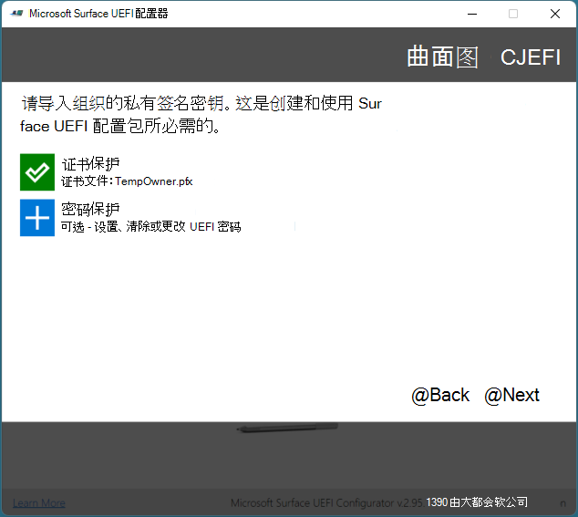

# Microsoft Surface 企业版管理模式

Microsoft Surface 企业管理模式 (SEMM) 是具有 Surface UEFI 的 Surface 设备的一种功能，可用于保护和管理组织内的固件设置。 通过 SEMM，IT 专业人员可以准备 UEFI 设置的配置，并将其安装在 Surface 设备上。 除了配置 UEFI 设置之外，SEMM 还使用证书来保护配置免遭未经授权的篡改或删除。

>[!NOTE]
>SEMM 仅在具有 Surface UEFI 固件的设备上可用。 这包括大多数 Surface 设备，包括 Surface Pro 7、Surface Pro X 和 Surface 笔记本电脑3商业 Sku 与英特尔处理器。 SEMM 不支持在 15 "Surface 笔记本电脑 3 SKU 上使用 AMD 处理器， (仅供零售 SKU) 使用。 

当 Surface 设备由 SEMM 配置并使用 SEMM 证书进行保护时，它们被视为已*注册*SEMM。 删除 SEMM 证书并将 UEFI 设置的控制权返回给设备用户时，Surface 设备被视为 SEMM 中的*unenrolled* 。

你可以使用两个管理选项来管理 SEMM 和注册的 Surface 设备-独立工具或与 Microsoft 终结点配置管理器的集成。 本文介绍了 SEMM 独立工具，称为 Microsoft Surface UEFI 配置器。 有关如何使用 Microsoft 终结点配置管理器管理 SEMM 的详细信息，请参阅[使用 Microsoft 终结点配置管理器管理具有 SEMM 的设备](https://technet.microsoft.com/itpro/surface/use-system-center-configuration-manager-to-manage-devices-with-semm)。


## Microsoft Surface UEFI 配置器

SEMM 的主要工作区是 Microsoft Surface UEFI 配置器，如图1所示。 Microsoft Surface UEFI 配置器是用于创建 Windows Installer ( .msi) 程序包或 WinPE 映像的工具，用于在 Surface 设备上注册、配置和取消注册 SEMM。 这些程序包包含指定了 UEFI 设置的配置文件。 SEMM 程序包还包含安装并存储在固件中的证书，并用于在应用 UEFI 设置之前验证配置文件的签名。

>[!NOTE]
>现在，你可以使用 Surface UEFI 配置器和 SEMM 来管理 Surface Dock 2 上的端口。 若要了解详细信息，请参阅[安全 Surface Dock 2 端口和 SEMM](secure-surface-dock-ports-semm.md)。


*图 1. Microsoft Surface UEFI 配置器*


可在三种模式下使用 Microsoft Surface UEFI 配置器工具：

* [SURFACE UEFI 配置包](#configuration-package)。 使用此模式创建 Surface UEFI 配置包以在 SEMM 中注册 Surface 设备并在已注册的设备上配置 UEFI 设置。
* [SURFACE UEFI 重置程序包](#reset-package)。 使用此模式取消注册 SEMM 中的 Surface 设备。
* [SURFACE UEFI 恢复请求](#recovery-request)。 使用此模式响应从 SEMM 中取消注册 Surface 设备的恢复请求，其中重置程序包操作不成功。


#### 下载 Microsoft Surface UEFI 配置器

你可以从 Microsoft 下载中心的[IT "Surface Tools for IT](https://www.microsoft.com/download/details.aspx?id=46703) " 页面下载 MICROSOFT Surface UEFI 配置器。

### 配置包

Surface UEFI 配置包是在 Surface 设备上实现和管理 SEMM 的主要机制。 这些程序包包含在 Microsoft Surface UEFI 配置文件和证书文件中创建程序包期间指定的 UEFI 设置的配置文件，如图2所示。 当在尚未注册 SEMM 的 Surface 设备上首次运行配置包时，它会在设备固件中预配证书文件，并在 SEMM 中注册该设备。 在 SEMM 中注册设备时，系统会提示你通过在存储证书文件和注册可以完成之前提供 SEMM 证书指纹的最后两位数字来确认操作。 此确认要求在注册时在设备上显示一个用户以执行确认。



*图 2. 使用证书保护 SEMM 配置包*

有关 SEMM 证书要求的详细信息，请参阅本文的 " [Surface Enterprise 管理模式证书要求](#surface-enterprise-management-mode-certificate-requirements)" 部分。

>[!NOTE]
>你还可以使用 SEMM 指定 UEFI 密码，以便查看 Surface UEFI 的**安全**、**设备**、**启动配置**或**企业管理**页面。

在 SEMM 中注册设备后，将读取配置文件，并将文件中指定的设置应用于 UEFI。 在已在 SEMM 中注册的设备上运行配置包时，将根据存储在设备固件中的证书检查配置文件的签名。 如果签名不匹配，则不会对设备应用任何更改。

### 在 SEMM 中启用或禁用 Surface UEFI 中的设备

以下列表显示了可在 SEMM 中管理的所有可用设备：

* 插接 USB 端口
* 板载音频
* DGPU
* Type Cover
* 微型 SD 卡
* 前置摄像头
* 后置摄像头
* Windows Hello 红外摄像头
* 仅限蓝牙
* WLAN 和蓝牙
*              LTE           

 >[!NOTE]
>在 "UEFI 设备" 页面中显示的内置设备可能会有所不同，具体取决于你的设备或公司环境。 例如，"UEFI 设备" 页面在 Surface Pro X 上不受支持;仅在安装了 LTE 的设备上显示 LTE。 
### 配置 SEMM 的高级设置
**表 1.  高级设置**

| 设置                            | 描述                                                                                                                                                                                        |
| ---------------------------------- | -------------------------------------------------------------------------------------------------------------------------------------------------------------------------------------------------- |
| 用于 PXE 启动的 IPv6                  | 允许管理 PXE 启动的 Ipv6 支持。 如果未配置此设置，将禁用 IPv6 支持 PXE。                                                                               |
| 备用启动                     | 允许管理备用启动顺序的使用，以便通过在启动过程中按下 "音量按下" 按钮和 "电源" 按钮直接引导到 USB 或以太网设备。 如果未配置此设置，则启用备用启动。 |
| 启动顺序锁                    | 允许你锁定启动顺序以防止更改。 如果未配置此设置，则禁用 "启动订单锁定"。                                                                                                        |
| USB 启动                           | 允许你管理对 USB 设备的启动。 如果未配置此设置，则启用 USB 引导。                                                                                                                 |
| 网络堆栈                      | 允许你管理网络堆栈启动设置。 如果未配置此设置，将禁用管理网络堆栈启动设置的功能。                                                                                                           |
| 自动打开电源                      | 允许管理 "自动开机启动" 设置。 如果未配置此设置，则启用 "自动加电"。                                                                                                        |
| 同时多线程 (SMT)  | 允许你管理同时多线程 (SMT) ，以启用或禁用超线程。 如果未配置此设置，则启用 SMT。                                                  |
|启用电池限制| 允许您管理电池限制功能。 如果未配置此设置，则启用电池限制 |
| 安全性                           | 显示 "Surface UEFI**安全**" 页面。 如果未配置此设置，则显示 "安全" 页面。                                                                                                                 |
| 设备                            | 显示 "Surface UEFI**设备**" 页面。 如果未配置此设置，则会显示 "设备" 页面。                                                                                                                     |
| 靴子                               | 显示 Surface UEFI**启动**页面。 如果未配置此设置，将显示 "启动" 页面。                                                                                                                                                            |
| DateTime                           | 显示 Surface UEFI**日期时间**页面。 如果未配置此设置，则显示 "日期时间" 页面。                                                                                                                |


>[!NOTE]
>创建 SEMM 配置包时，**成功**的页面上将显示两个字符，如图3所示。


*图 3. 成功页面上证书指纹的最后两个字符的显示*

这些字符是证书指纹的最后两个字符，应进行写下或录制。 需要使用字符来确认 Surface 设备上 SEMM 中的注册，如图4所示。


*图 4. SEMM 中具有 SEMM 证书指纹的注册确认*

>[!NOTE]
>有权访问证书文件 ( .pfx) 的管理员可以随时通过在 CertMgr 中打开 .pfx 文件来读取指纹。 若要查看 CertMgr 的指纹，请执行以下过程：
>1. 右键单击 .pfx 文件，然后单击 "**打开**"。
>2. 展开 "导航窗格" 中的文件夹。
>3. 单击“**证书**”。
>4. 在主窗格中右键单击您的证书，然后单击 "**打开**"。
>5. 单击 "**详细信息**" 选项卡。
>6. 只有在 "**显示**" 下拉菜单中选择 "**全部**" 或 "**属性**"。
>7. 选择 "字段**指纹**"。

若要在 SEMM 中注册 Surface 设备或应用来自配置包的 UEFI 配置，您需要执行的所有操作都是使用管理权限在目标 Surface 设备上运行 .msi 文件。 你可以使用应用程序部署或操作系统部署技术（如[Microsoft 终结点配置管理器](https://technet.microsoft.com/library/mt346023)或[microsoft 部署工具包](https://technet.microsoft.com/windows/dn475741)）。 在 SEMM 中注册设备时，您必须在设备上进行注册以确认注册。 将配置应用到已在 SEMM 中注册的设备时，不需要用户交互。

有关如何在 SEMM 中注册 Surface 设备或使用 SEMM 应用 Surface UEFI 配置的分步演练，请参阅[使用 SEMM 注册和配置 surface 设备](https://technet.microsoft.com/itpro/surface/enroll-and-configure-surface-devices-with-semm)。

### 重置程序包

Surface UEFI 重置程序包仅用于执行一项任务，即取消注册 SEMM 中的 Surface 设备。 Reset 程序包包含从设备固件中删除 SEMM 证书以及将 UEFI 设置重置为出厂默认设置的签名说明。 与 Surface UEFI 配置包一样，必须使用在 Surface 设备上预配的同一 SEMM 证书对重置程序包进行签名。 创建 SEMM 重置程序包时，你需要提供要重置的 Surface 设备的序列号。 SEMM reset 程序包不是通用的，并且特定于一个设备。

### 恢复请求

在某些情况下，可能不可能使用 Surface UEFI 重置程序包。 例如，如果 Windows 在 Surface 设备上不可用，则 (。 ) 在这些情况下，你可以通过 Surface (UEFI 的**企业管理**页面取消注册 surface 设备，如图 5) 中的 "恢复请求" 操作所示。


*图 5. 在 "企业管理" 页面上启动 SEMM 恢复请求*

使用**企业管理**页面上的流程重置 Surface 设备上的 SEMM 时，会向你提供一个重置请求。 此重置请求可以另存为文件，将其作为一个文件保存到 USB 驱动器、复制为文本或作为 QR 代码读取，使用移动设备轻松地通过电子邮件发送或 messaged。 使用 Microsoft Surface UEFI 配置器重置请求选项加载重置请求文件或输入重置请求文本或 QR 代码。 Microsoft Surface UEFI 配置器将生成可在 Surface 设备上输入的验证代码。 如果您在 Surface 设备上输入代码，然后单击 "**重启**"，则设备将从 SEMM unenrolled。 

>[!NOTE]
>在创建重置请求后，将在两个小时内过期。

有关如何取消注册 SEMM 中的 Surface 设备的分步演练，请参阅[从 SEMM 中注销 surface 设备](https://technet.microsoft.com/itpro/surface/unenroll-surface-devices-from-semm)。

## Surface Enterprise 管理模式证书要求

>[!NOTE]
>SEMM 证书是对已注册的 Surface 设备上的 SEMM 或 Surface UEFI 设置执行任何修改所必需的。 如果 SEMM 证书已损坏或丢失，则无法删除或重置 SEMM。 使用适用于备份和恢复的解决方案，相应地管理你的 SEMM 证书。

使用 Microsoft Surface UEFI 配置工具创建的程序包已使用证书进行签名。 此证书确保在 SEMM 中注册设备后，只能使用使用已批准证书创建的程序包来修改 UEFI 的设置。 对于 SEMM 证书，建议使用以下设置：

* **密钥算法**-RSA 
* **密钥长度**-2048
* **哈希算法**-SHA-256
* **类型**-SSL 服务器身份验证
* **密钥用法**-数字签名、密钥译码
* **提供商**-Microsoft 增强的 RSA 和 AES 加密提供程序
* **过期日期**-从证书创建到15个月
* **密钥导出策略**-可导出

我们还建议在两层公钥基础结构中验证 SEMM 证书 (PKI) 体系结构，其中的中间证书颁发机构 (CA) 专用于 SEMM，从而允许证书吊销。 有关双层 PKI 配置的详细信息，请参阅[测试实验室指南：部署 AD CS 双层 PKI 层次结构](https://technet.microsoft.com/library/hh831348)。

>[!NOTE]
>你可以使用以下 PowerShell 脚本创建自签名证书，以便在概念验证方案中使用。
 > 若要使用此脚本，请将以下文本复制到记事本中，并将该文件另存为 PowerShell 脚本 ( ps1) 。 此脚本将创建一个密码为的证书 `12345678` 。<br/><br/>对于生产环境，不推荐使用此脚本生成的证书。
  
   ```
if (-not (Test-Path "Demo Certificate"))  { New-Item -ItemType Directory -Force -Path "Demo Certificate" }
if (Test-Path "Demo Certificate\TempOwner.pfx") { Remove-Item "Demo Certificate\TempOwner.pfx" }

# Generate the Ownership private signing key with password 12345678
$pw = ConvertTo-SecureString "12345678" -AsPlainText -Force

$TestUefiV2 = New-SelfSignedCertificate `
  -Subject "CN=Surface Demo Kit, O=Contoso Corporation, C=US" `
  -Type SSLServerAuthentication `
  -HashAlgorithm sha256 `
  -KeyAlgorithm RSA `
  -KeyLength 2048 `
  -KeyUsage KeyEncipherment `
  -KeyUsageProperty All `
  -Provider "Microsoft Enhanced RSA and AES Cryptographic Provider" `
  -NotAfter (Get-Date).AddYears(25) `
  -TextExtension @("2.5.29.37={text}1.2.840.113549.1.1.1") `
  -KeyExportPolicy Exportable

$TestUefiV2 | Export-PfxCertificate -Password $pw -FilePath "Demo Certificate\TempOwner.pfx"
   ```

若要与 SEMM 和 Microsoft Surface UEFI 配置器一起使用，必须使用私钥和密码保护导出证书。 Microsoft Surface UEFI 配置器将提示你在需要时选择 SEMM 证书文件 ( .pfx) 和证书密码。

>[!NOTE]
>对于在其 PKI 基础结构中使用脱机根目录的组织，Microsoft Surface UEFI 配置程序必须在连接到根 CA 的环境中运行，才能对 SEMM 证书进行身份验证。 由 Microsoft Surface UEFI 配置器生成的程序包可以作为文件进行传输，因此可以使用可移动存储（如 USB）在离线网络环境外传输。

### 管理证书常见问题

建议的*最小*长度为15个月。 你可以使用在15个月内过期的证书，也可以使用超过15个月后过期的证书。

>[!NOTE] 
>证书到期后，它不会自动续订。 

**在15个月后，现有计算机是否会继续应用 bios 设置？**

是，但仅在证书有效时对程序包本身进行签名的情况下。

**Will** **SEMM 软件包和证书是否需要在所有计算机上更新？**

如果你希望 SEMM 重置或恢复正常工作，证书必须有效且未过期。 

**是否可以为我们订购的每个 surface 创建批量重置程序包？ 是否可以构建一个用于重置我们环境中的所有计算机的程序？**

为特定设备类型创建配置包的 PowerShell 示例也可用于创建独立于序列号的重置程序包。 如果证书仍然有效，你可以使用 PowerShell 重置 SEMM 来创建重置程序包。

## 版本历史记录


### 版本2.73.136。0

此版本的 SEMM 包括：

- 现在可以使用 SEMM 在 Surface Hub2S 上禁用音频
- 对 Dock 2 的 Surface Pro X 的支持
- 对与 Dock 2 相关操作的 UEFI 管理器的支持
- Surface Go 重置程序包 bug 修复

### 版本2.71.139。0

此版本的 SEMM 为 Surface Dock 2 管理功能添加了对 Surface Book 3、Surface 笔记本3和 Surface Pro 7 的支持，包括：

- 启用音频 (锁定/解锁) 、以太网和 USB 端口
- 为经过身份验证的主机和未经身份验证的主机创建 dock 程序包的能力

### 版本2.70.130。0

此版本的 SEMM 包括：

- 支持 Surface Go 2
- Surface Book 3 支持
- Bug 修复


### 版本2.59.139。0

* 支持 Surface Pro 7、Surface Pro X 和 Surface 笔记本电脑 3 13.5 "和 15" 型号的英特尔处理器。 注意： Surface 笔记本电脑 3 15 "不支持 AMD 处理器。

- 对 Power on Power 功能的支持

### 版本2.54.139。0
* 对 Surface Hub 2 的支持
* Bug 修复

### 版本2.43.136。0
* 支持以启用/禁用 simulatenous multithreating 
* 针对某些设备的 WiFi 和蓝牙的单独选项 
* 已删除 Surface Studio 的电池限制 

### 版本2.26.136。0
* 向 Surface Studio 2 添加支持
* 电池限制功能

### 版本2.21.136。0
* 向 Surface Pro 6 添加支持
* 向 Surface 笔记本电脑2添加支持

### 版本2.14.136。0
* 向 Surface Go 添加支持

### 版本 2.9.136.0
* 向 Surface Book 2 添加支持
* 向 Surface Pro LTE 添加支持
* 辅助功能改进

### 版本1.0.74。0
* 向 Surface 笔记本电脑添加支持
* 向 Surface Pro 添加支持
* Bug 修复和常规改进

## 相关主题

- [使用 SEMM 注册并配置 Surface 设备](enroll-and-configure-surface-devices-with-semm.md)
- [从 SEMM 取消注册 Surface 设备](unenroll-surface-devices-from-semm.md)
- [使用 SEMM 保护 Surface Dock 2 端口](secure-surface-dock-ports-semm.md)
